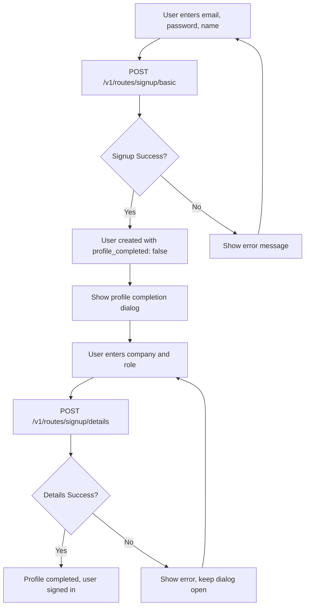

# Signup API Implementation

## Overview

This document describes the implementation of a **two-step signup process** for user registration using Supabase Auth with extended profile storage:

1. **Step 1**: `POST /v1/routes/signup/basic` - Create user account with basic information
2. **Step 2**: `POST /v1/routes/signup/details` - Add company and role details to complete profile

## Signup Flow



## Implementation Summary

The signup functionality has been implemented with the following components:

### 1. Supabase Configuration (`src/config/supabase.ts`)
- Configured Supabase client with environment variables
- Defined TypeScript interfaces for `UserProfile`, `SignupRequest`, and `SignupResponse`
- Handles connection to Supabase Auth and Database

### 2. Authentication Service (`src/services/authService.ts`)
- `AuthService.signupBasic()` - Calls the backend basic signup endpoint
- `AuthService.signupDetails()` - Calls the backend signup details endpoint
- `AuthService.signIn()` - Handles user login with Supabase Auth
- `AuthService.getUserProfile()` - Retrieves user profile from 'users' table
- `AuthService.updateUserProfile()` - Updates user profile information (fallback)
- Auth state management and session handling

### 3. API Configuration (`src/config/api.ts`)
- Added `SIGNUP_BASIC` endpoint: `${API_BASE_URL}/v1/routes/signup/basic`
- Added `SIGNUP_DETAILS` endpoint: `${API_BASE_URL}/v1/routes/signup/details`
- Configurable API base URL via environment variables

### 4. Auth Context Updates (`src/contexts/AuthContext.tsx`)
- Added `signup()` function for basic signup to the auth context
- Updated `completeProfile()` function to use the signup details endpoint
- Updated authentication flow to use Supabase Auth
- Maintains backward compatibility with demo admin credentials
- Real-time auth state management with Supabase listeners

### 5. UI Integration (`src/components/auth/AuthModal.tsx`)
- Updated signup form to use the new `signup()` function
- Proper error handling and user feedback
- Seamless integration with existing login flow

## API Specification

### Step 1: Basic Signup
```
POST /v1/routes/signup/basic
```

#### Request Body
```json
{
  "email": "user@example.com",
  "password": "string",
  "name": "string"
}
```

#### Response
```json
"User registered successfully"
```

**Note:** The basic signup endpoint returns just a string message. The user must then sign in to get their profile data.

### Step 2: Signup Details
```
POST /v1/routes/signup/details
```

#### Headers
```
Authorization: Bearer <jwt_token>
Content-Type: application/json
```

#### Request Body
```json
{
  "company_name": "string",
  "role": "string"
}
```

#### Response
```json
{
  "user": {
    "id": "uuid",
    "email": "user@example.com",
    "name": "string",
    "company_name": "Example Corp",
    "job_role": "Software Engineer",
    "profile_completed": true,
    "role": "user",
    "created_at": "2024-01-01T00:00:00Z",
    "updated_at": "2024-01-01T00:00:00Z"
  },
  "message": "Profile completed successfully"
}
```

## Environment Variables Required

The implementation expects the following environment variables:

```bash
# Supabase Configuration
VITE_CSA_SUPABASE_URL=your-supabase-url
VITE_CSA_SUPABASE_KEY=your-supabase-anon-key
VITE_CSA_SUPABASE_SERVICE_KEY=your-supabase-service-key
VITE_CSA_JWT_SECRET_KEY=your-jwt-secret

# API Configuration
VITE_PROD_API_URL=https://your-backend-api.com
VITE_DEV_API_URL=http://localhost:8000
```

## Database Schema

The implementation expects a `users` table with the following structure:

```sql
CREATE TABLE users (
  id UUID PRIMARY KEY DEFAULT gen_random_uuid(),
  email VARCHAR NOT NULL UNIQUE,
  name VARCHAR NOT NULL,
  company_name VARCHAR,
  job_role VARCHAR,
  profile_completed BOOLEAN DEFAULT false,
  role VARCHAR DEFAULT 'user' CHECK (role IN ('user', 'admin')),
  created_at TIMESTAMP WITH TIME ZONE DEFAULT NOW(),
  updated_at TIMESTAMP WITH TIME ZONE DEFAULT NOW()
);
```

## Usage Examples

### Frontend Usage

#### Step 1: Basic Signup
```typescript
import { useAuth } from '@/contexts/AuthContext';

function SignupForm() {
  const { signup, loading } = useAuth();

  const handleSignup = async (formData) => {
    try {
      const success = await signup({
        email: formData.email,
        password: formData.password,
        name: formData.name
      });
      
      if (success) {
        console.log('User registered successfully');
        // User will be prompted for profile completion automatically
      }
    } catch (error) {
      console.error('Signup failed:', error.message);
    }
  };
}
```

#### Step 2: Profile Completion (Automatic)
The profile completion dialog will automatically appear after signup. When the user fills in their company and role:

```typescript
import { useAuth } from '@/contexts/AuthContext';

function ProfileCompletionDialog() {
  const { completeProfile, loading } = useAuth();

  const handleCompleteProfile = async (profileData) => {
    try {
      await completeProfile({
        companyName: profileData.companyName,
        jobRole: profileData.jobRole
      });
      
      console.log('Profile completed successfully');
    } catch (error) {
      console.error('Profile completion failed:', error.message);
    }
  };
}
```

### Direct API Calls

#### Step 1: Basic Signup
```typescript
import { API_ENDPOINTS } from '@/config/api';

const signupUser = async (userData) => {
  try {
    const response = await fetch(API_ENDPOINTS.SIGNUP_BASIC, {
      method: 'POST',
      headers: {
        'Content-Type': 'application/json',
      },
      body: JSON.stringify(userData),
    });

    if (!response.ok) {
      throw new Error(`HTTP error! status: ${response.status}`);
    }

    const result = await response.json();
    return result;
  } catch (error) {
    console.error('Signup error:', error);
    throw error;
  }
};
```

#### Step 2: Signup Details
```typescript
import { API_ENDPOINTS } from '@/config/api';

const completeSignup = async (detailsData) => {
  try {
    // Get current session token
    const { data: { session } } = await supabase.auth.getSession();
    
    if (!session?.access_token) {
      throw new Error('No valid session found');
    }
    
    const response = await fetch(API_ENDPOINTS.SIGNUP_DETAILS, {
      method: 'POST',
      headers: {
        'Content-Type': 'application/json',
        'Authorization': `Bearer ${session.access_token}`,
      },
      body: JSON.stringify(detailsData),
    });

    if (!response.ok) {
      throw new Error(`HTTP error! status: ${response.status}`);
    }

    const result = await response.json();
    return result;
  } catch (error) {
    console.error('Signup details error:', error);
    throw error;
  }
};
```

## Backend Implementation Notes

### Step 1: Basic Signup Endpoint
The `/v1/routes/signup/basic` endpoint should:

1. **Validate Input**: Ensure email, password, and name are provided
2. **Create Supabase Auth User**: Use Supabase Auth Admin API to create the user
3. **Store Extended Profile**: Insert user data into the 'users' table with `profile_completed: false`
4. **Handle Errors**: Provide meaningful error messages for various failure cases
5. **Return User Data**: Return the created user profile information

### Step 2: Signup Details Endpoint
The `/v1/routes/signup/details` endpoint should:

1. **Validate Input**: Ensure company_name and role are provided
2. **Authenticate User**: Verify the user is signed in (check JWT token)
3. **Update Profile**: Update the user's profile with company and role information
4. **Mark Complete**: Set `profile_completed: true`
5. **Return Updated Data**: Return the updated user profile information

### Example Backend Implementation (Node.js/Express)

#### Step 1: Basic Signup
```javascript
app.post('/v1/routes/signup/basic', async (req, res) => {
  try {
    const { email, password, name } = req.body;

    // Validate input
    if (!email || !password || !name) {
      return res.status(400).json({ 
        message: 'Email, password, and name are required' 
      });
    }

    // Create user in Supabase Auth
    const { data: authUser, error: authError } = await supabase.auth.admin.createUser({
      email,
      password,
      email_confirm: true // Auto-confirm for demo
    });

    if (authError) {
      return res.status(400).json({ message: authError.message });
    }

    // Store extended profile in users table
    const { data: userProfile, error: profileError } = await supabase
      .from('users')
      .insert({
        id: authUser.user.id,
        email,
        name,
        profile_completed: false,
        role: 'user'
      })
      .select()
      .single();

    if (profileError) {
      // Cleanup: delete auth user if profile creation fails
      await supabase.auth.admin.deleteUser(authUser.user.id);
      return res.status(500).json({ message: 'Failed to create user profile' });
    }

    res.status(201).json({
      user: userProfile,
      message: 'User registered successfully'
    });

  } catch (error) {
    console.error('Signup error:', error);
    res.status(500).json({ message: 'Internal server error' });
  }
});
```

#### Step 2: Signup Details
```javascript
app.post('/v1/routes/signup/details', async (req, res) => {
  try {
    const { company_name, role } = req.body;

    // Validate input
    if (!company_name || !role) {
      return res.status(400).json({ 
        message: 'Company name and role are required' 
      });
    }

    // Get user from JWT token (implement your auth middleware)
    const authHeader = req.headers.authorization;
    
    if (!authHeader || !authHeader.startsWith('Bearer ')) {
      return res.status(401).json({ message: 'Missing or invalid authorization header' });
    }
    
    const token = authHeader.substring(7); // Remove 'Bearer ' prefix
    
    // Verify JWT token with Supabase
    const { data: { user }, error: authError } = await supabase.auth.getUser(token);
    
    if (authError || !user) {
      return res.status(401).json({ message: 'Invalid or expired token' });
    }

    // Update user profile in users table
    const { data: userProfile, error: profileError } = await supabase
      .from('users')
      .update({
        company_name,
        role: role,
        profile_completed: true,
        updated_at: new Date().toISOString()
      })
      .eq('id', user.id)
      .select()
      .single();

    if (profileError) {
      return res.status(500).json({ message: 'Failed to update user profile' });
    }

    res.status(200).json({
      user: userProfile,
      message: 'Profile completed successfully'
    });

  } catch (error) {
    console.error('Signup details error:', error);
    res.status(500).json({ message: 'Internal server error' });
  }
});
```

## Security Considerations

1. **Password Validation**: Implement strong password requirements
2. **Rate Limiting**: Prevent signup abuse with rate limiting
3. **Email Verification**: Consider requiring email verification
4. **Input Sanitization**: Sanitize all user inputs
5. **CORS Configuration**: Properly configure CORS for your domain
6. **Environment Variables**: Keep Supabase keys secure and use appropriate key types

## Testing

To test the implementation:

1. **Set Environment Variables**: Configure all required Supabase and API environment variables
2. **Backend Setup**: Ensure the backend endpoint is implemented and running
3. **Database Setup**: Create the users table with the correct schema
4. **Frontend Testing**: Use the signup form in the AuthModal component
5. **Integration Testing**: Verify the complete flow from frontend to database

## Error Handling

The implementation handles various error scenarios:

- **Validation Errors**: Missing required fields
- **Authentication Errors**: Supabase Auth failures (duplicate email, weak password)
- **Network Errors**: API communication failures
- **Database Errors**: Profile creation failures
- **User Feedback**: Clear error messages displayed to users

## Future Enhancements

1. **Email Verification**: Add email confirmation flow
2. **Social Authentication**: Integrate with Google/LinkedIn OAuth
3. **Password Reset**: Implement password reset functionality
4. **Profile Completion**: Enhanced onboarding flow
5. **Role Management**: Admin user creation and management
6. **Audit Logging**: Track user registration events
